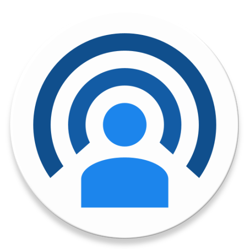
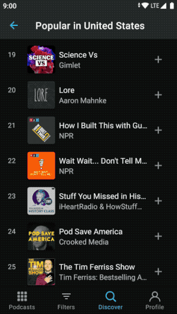

<h2 align="center"><b>Pod Ratings</b></h2>
<h4 align="center">An Android app that uses an accessibility service to show podcast shows ratings.</h4>

## Download
You can download the APK file [here](https://github.com/grivos/PodRatings/releases/download/v1.0.0/pod_ratings_v1.0.0.apk).

## Demo

## License
  

Pod Ratings is a free software: You can use, study, share and improve it at your
will. Specifically you can redistribute and/or modify it under the terms of the
[GNU General Public License](https://www.gnu.org/licenses/gpl.html) as
published by the Free Software Foundation, either version 3 of the License, or
(at your option) any later version. 
